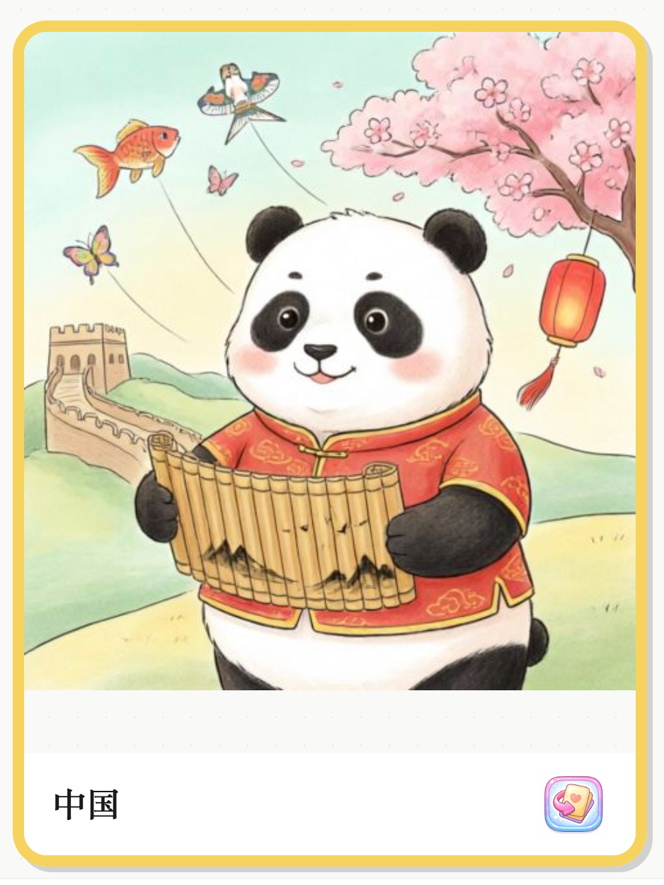
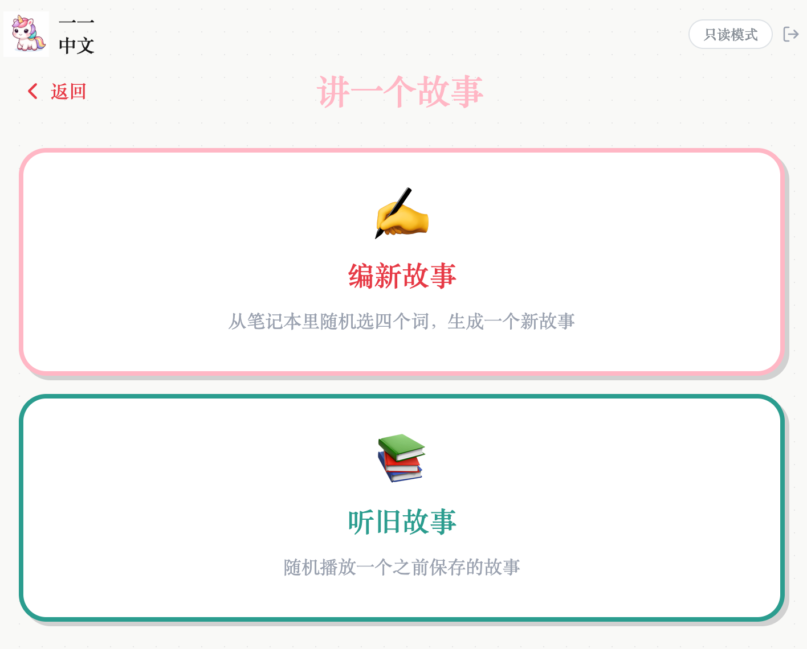

Sophie Liu
Posted in Share Your Projects
Chai John <john.chai2001@gmail.com>

⼀只独⻆兽，三个AI模型，和我学中⽂的五岁⼥⼉
1 message
Superlinear Academy <no-reply@notifications.superlinear.academy>
Fri, May 15, 2026 at 3:15 AM
Reply-To: Superlinear Academy <yz@superlinear.academy>
To: john.chai2001@gmail.com

⼀只独⻆兽，三个AI模型，和我学中⽂的五岁⼥⼉

我和先⽣住在瑞⼠，有⼀个五岁的⼥⼉。在她出⽣前我们就决定：先⽣跟她说瑞⼠德
语，我跟她说中⽂——这样即使住在瑞⼠，⼥⼉也可以保持基本的中⽂听说。在⼥⼉
四岁左右的时候，她开始上⼀对⼀的在线中⽂课，虽然价格不菲，但好在她很喜欢这
位⽼师，有很强的⾃主学习意愿，⼀年多下来积累了⼀些进步。
但是，她只喜欢跟⽼师互动的部分，对课后作业完全没兴趣。⽽且，这个课程的作业
设计也并不能真的帮她学习，因为设计模版化，有时候她不认识字，瞎猜⼏下也能做
对做完。
结果就是她每周学每周忘，边学边忘，跟狗熊掰⽟⽶⼀样。
我试了不少办法。买认字书、在家⾥贴⼤幅认字海报、写字卡带在包⾥没事拿出来
看。每个办法最多管个两三次吧，之后她就没兴趣了。遇到这种情况我也不想强迫她
继续，毕竟她的⾃主兴趣才是她能⻓期学下去最重要的动⼒。当然，我也认识到，⾃
⼰找的这些所谓"学习⽅法与⼯具"对⼀个四五岁的⼩孩⼉来说，⼀点⼉都不好玩⼉。
她很快就识破了它们背后浓浓的⽬的性，所以本能地抵触。
我也试着找了⼀些给⼩朋友认字的App。但它们⼤多拥有⼀样枯燥的内核，还有⼀⾔
难尽的⻚⾯设计，要么花⾥胡哨让⼩朋友根本没法集中注意⼒，要么充斥⼴告。⽽
且，这些App⾥的词汇跟⼥⼉的中⽂课并不同步，就很难达到帮她复习的⽬的了。
那段时间我刚好对AI和Vibe Coding很上头，就决定：既然⾃⼰有这么明确的⽤户需
求，市⾯上⼜没有合适的解决⽅法，⼲脆⾃⼰做⼀个。有天晚上刷⼩红书看到张咋啦
的视频，介绍她在Google AI Studio⾥给⾃⼰做的学⽇语App。我突然意识到，这个主
意很适合给⼥⼉做个学中⽂的“类词典”App。于是当晚就打开Google AI Studio试了
试，不到⼆⼗分钟，实现了输⼊中⽂词、⽣成读⾳和图⽚的过程。刚好遇到复活节假

---

期，就决定⽤两天（⼤概⼗个⼩时）的时间，做出⼀个真正能⽤的产品。当时还跟⼥
⼉夸下海⼝：妈妈要做个复活节礼物给你。

⼀⼀中⽂
结果真的做出来了（下⾯附了产品Demo视频）。并且⽤⼥⼉想象中的好朋友“⼀⼀”
（⼀直五岁的独⻆兽⼩朋友）命名为“⼀⼀中⽂”，图标是在ChatGPT⾥⽣成的⼀只可
爱的独⻆兽。对⼥⼉来说，⽤App学习中⽂的过程，就是跟“⼀⼀”⼀起玩⼉的过程。
我们平时是这么⽤的：我跟⼥⼉坐在⼀起，我帮她输⼊这周新学的词汇（⽐如"中
国"）、或者她突发奇想出来的任何词汇（⽐如"迪⼠尼"），屏幕上就会出现⼀张卡
⽚，正⾯是⼤⼤的"中国"两个字。按⼀下喇叭按钮，可以听到温柔的⼥声普通话发
⾳。点⼀下翻⾯，可以看到卡⽚背后⼀张AI⽣成的绘本⻛格插画——穿着唐装的可爱
熊猫
，背景还有⻓城、⻛筝、灯笼这些中国⻛元素。我⼥⼉看到这张图的时候忍不
住跟我说：“妈妈，⼀⼀真是太会画画了
”。喜欢这个词和图⽚？点击"笔记本"按
钮，轻松保存供后续复习。

---

在笔记本攒够四个词之后，就可以让"⼀⼀"编故事：它会从笔记本随机挑四个词，编
成⼀个四五句话的⼩故事，⽤到的词⽤红⾊标出来，还会单独显示在故事⽂本框下
⾯。按喇叭按钮还可以朗读故事。每次⽣成新故事都要调⽤API，所以我就把已经⽣
成的故事（⽂本和⾳频）保存下来，在点击"听旧故事"按钮的时候直接播放。这本来
是为了省token，后来发现这其实是挺好的复习⽅式——⼥⼉也会主动选旧故事重听，

---

不知不觉地加深记忆。

整个使⽤过程中，⼥⼉只需要我帮她输⼊中⽂词，其它步骤都可以⾃⼰完成。但这个
parent-in-the-loop是我专⻔设计的：⼀⽅⾯可以保持词汇跟她中⽂课的进度⼀致，另
⼀⽅⾯我也对输⼊的词汇有所把控，让她看到的语⾳、图⽚、故事都是经过我筛选
的。
App⻚⾯的设计则是我先在Excalidraw⾥画出来，然后给Claude Code直接⽣成。
Screen Recording 2026-05-14 at 16.07.32.MOV

三个AI模型怎么分⼯
这个App背后有三个AI模型：
给词语画插画： 可以直接从中⽂词输⼊⽣成绘本⻛格图⽚，质量很⾼。图⽚⼤多都
⾮常可爱，经常给⼥⼉⼩⼩的"哇哦"瞬间。⽤的是Together AI上的Qwen-Image-
2.0。

---

给词语和故事朗读： 温柔⾃然的⼥声，接近真⼈讲故事的感觉。⽤的是阿⾥云
DashScope的Qwen3-TTS-Flash（Cherry声⾳）。
编故事： 从笔记本选词，编成适合⼩朋友的短故事。故事⽣成的逻辑并不是很严
谨，但反倒有点⼉搞笑的反转在⾥⾯，⼜很可爱，还能重复词汇。"讲故事"是这个
App⾥⼥⼉最喜欢的功能，可以⾃⼰⼀直点、⼀直听，靠灌⽿⾳和重复显示词汇加
深记忆。⽤的是阿⾥云DashScope的Qwen-Plus。
Qwen系列模型是踩了不少坑之后才选择的，跌坑和爬坑经验分享在下⾯。

成本
四⽉份是初始开发期，期间有密集的测试，⽣成了100+个词卡（包括语⾳和图⽚）以
及100+个故事，当⽉总花费⼤概3.16美元。⼩朋友每周能学的新词有限，⽇常使⽤会
更低。
成本这么低有⼀个架构上的原因：图⽚只在第⼀次翻卡时⽣成，⽤户存进笔记本之后
就永久保存在存储层，之后每次打开都是毫秒级加载，不再调⽤AI模型。语⾳同理。
同时，为了不过度占⽤存储空间，也设置了图⽚⽂件不超过1MB，语⾳⽂件不超过
2MB的限制。⽬前还没有图⽚超限的情况，但语⾳有时候会过⼤，那就不存了，反正
Qwen调⽤很便宜，再⽣成⼀次就好。

---

踩过的坑：模型选择
最开始做图⽚⽣成时，Claude Code推荐了Gemini的图⽚模型。试了，效果不⾏。换
了⼀个Gemini模型，还是不⾏，⽣成了⼀些譬如有五只⼿指的⼿这样诡异的画⾯。
后来Claude Code⼜推荐了FLUX.1-schnell模型——这次问题更匪夷所思：图⽚上出
现了奇怪的汉字和⽇语混合体，后来发现原因是FLUX不能直接处理中⽂输⼊。于是
我不得不加了⼀层中⽂转英⽂翻译。结果图⽚虽然不乱码了，但⼜出了个新问题：我
输⼊"爸爸"，⽣成的图是⼀个教堂⾥的"神⽗"——因为英⽂翻译的"father"既可能是爸
爸，也可能是神⽗。⽽且我感觉FLUX.1-schnell应该没有或者很少⽤中⽂语境下的素
材训练，⽣成的⼈物图⽚全部都不是中国⼈，感觉给中⽂学习App上套了个欧美⼈设
的壳。
同时，语⾳⽣成的质量也是听不下去，⼜机械⼜怪异——根本不能给⼩朋友教中⽂，

---

逗她笑倒是很有效。
这时候，我才隐约感觉到，这些模型可能对中⽂并不适配，于是，让Claude对所有可
⽤的⽂⽣图和⽂⽣语⾳模型做⼀次系统性调研：给我总结⼀下它们的性能、成本、是
否原⽣⽀持中⽂、从欧洲和中国的可访问性、数据合规（EU/瑞⼠、美国和中国都要
考虑）。
结果是：Qwen系列在中⽂场景下全⾯领先，成本⼤约是其他模型的⼗分之⼀，⽽且
在每个区域都数据合规。
超乎我预料的是，即使表格的结果已经⾮常明确，Claude仍然在总结中推荐使⽤
Gemini模型。我问它：为什么要推荐⼜贵⼜不直接⽀持中⽂的Gemini？它才承认：因
为它对Gemini更熟悉。
经此⼀例，学到重要⼀课。"帮我选模型"和"帮我列出所有选项并按这五个维度打分"
这两个看起来差不多的要求，会产⽣天壤之别的效果。如果没有基于事实的检验，AI
⼯具的偏⻅很可能会把你带⼊它的舒适区。它的技术选型建议受训练数据分布影响
——它推荐它⻅得多的，不⼀定是最适合你场景的。运⽓不好的时候，它的舒适区可
能就是给你挖的⼀个⼤坑。

接下去呢？
作为我第⼀完全开发且部署的App，虽然并不复杂，但还是挺有成就感的，特别是现
在⼥⼉会经常⾃⼰跑来跟我说，妈妈，我想让⼀⼀给我讲故事：）
接下去，我很想给这个还是“学习⽓息浓重”的App添加⼀些好玩⼉的feature，⽐如今
天在⼩红书上看到⼀位爸爸开源的汉字对对碰游戏。其它爸爸妈妈们如果有好的建议
请多多指出，⾮常感谢！
另外，我还打算分享给⼀些家⻓试⽤，有下⾯两种⽅案：
免费款：可以使⽤所有已存在的词汇卡⽚和故事
付⼀点点费⽤（API确实不贵）：可以有⾃⼰⽣成词汇的权限。
先从免费版开始，开放20个名额，为了避免注册不⽤的情况，会加⼀个90天的开放时
限（从加⼊那天算起），有兴趣请私信我你的邮箱地址（如果你不想在评论区⾥公开
你的邮箱地址的话）。使⽤之后请多多给我反馈意⻅，在此拜谢

View post

---

Change notification settings    Unsubscribe from all emails