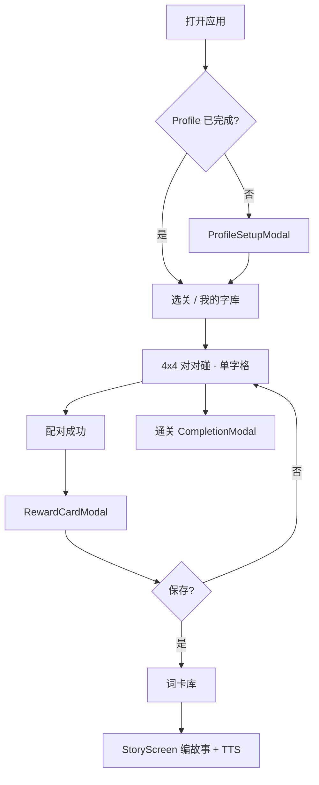

# 汉字对对碰 v2 — 开发进度总结

> 文档日期：2026-05-23  
> 项目路径：`hanzi-game`  
> 完整产品规划见 [`plan.md`](./plan.md)；设计参考见 [`game-design-framework.md`](./game-design-framework.md)

---

## 1. 项目定位

面向小学低年级（约 6–9 岁）的**汉字词语消除游戏**。在开源「汉字对对碰」基础上扩展：

- 与人教版语文课程对齐的单元字词库
- 配对成功后的 **AI 词卡**（按孩子 IP / 场景偏好生成插画）
- **词卡库** 与 **故事模块**（用词卡编故事 + 浏览器 TTS）
- 全部进度与资产保存在 **localStorage**，无后端数据库

---

## 2. 技术栈（当前）

| 类别 | 选型 |
|------|------|
| 框架 | Next.js **16.2.6**（App Router）+ React **19** + TypeScript |
| 样式 | 自定义 CSS（`app/globals.css`），未使用 Tailwind |
| AI 图片 | `@google/genai`，模型 `gemini-3-pro-image-preview`（中文 prompt） |
| AI 故事 | `@google/generative-ai` / `lib/gemini.ts` 文本生成 + **本地 fallback 故事** |
| TTS | 浏览器 Web Speech API（`hooks/useTTS.ts`） |
| 代理 | `undici` ProxyAgent，读取 `HTTPS_PROXY` / `HTTP_PROXY` |
| 持久化 | `localStorage`（存档、Profile、词卡、故事） |
| 部署 | Docker 或 Vercel（见 `plan.md`） |

环境变量（`.env.local`，不提交 git）：

```bash
GEMINI_API_KEY=your_key_here
# 可选：HTTPS_PROXY / HTTP_PROXY
```

---

## 3. 仓库结构（核心）

```
app/
  page.tsx                 # 路由：选关 / 游戏 / 词语本 / 故事
  layout.tsx, globals.css
  api/
    generate-image/        # 词卡图片
    generate-story/        # 故事文本（失败时 fallback）
components/                # 全部 'use client'
  GameScreen, GameBoard, CellTile, RewardCardModal, …
  LevelSelectScreen, WordBookScreen, StoryScreen
  ProfileSetupModal, CompletionModal, DeadlockModal, …
hooks/
  useGame, useLevels, useSaveData, useProfile
  useWordCardGeneration, useStory, useTTS
lib/gemini.ts
types.ts
public/
  curriculum/grade1_semester2.json   # 一年级下 · 人教版 · 8 单元
  levels.json                        # 旧版关卡（保留，当前主流程用 curriculum）
docs/
  plan.md, development-progress.md（本文）, …
```

---

## 4. 已完成功能

### 4.1 基础迁移与游戏核心

- [x] Vite 静态 SPA → Next.js App Router
- [x] 默认进入**选关界面**（修复首屏误进游戏）
- [x] 死局检测：消除后无可消对 → `DeadlockModal` 重排 / 重启
- [x] 进度条、提示、里程碑 Toast、通关弹窗
- [x] 自定义词库上传与「我的字库」Tab
- [x] 消除计数由关卡 `boardRows × boardCols / 2` **动态计算**（不再硬编码 18）

### 4.2 课程对齐（方向 A）

- [x] 数据源：`public/curriculum/grade1_semester2.json`（人教版一年级下学期，**8 个单元**）
- [x] 每单元含：课文列表、生字表、词对池、`boardRows` / `boardCols`（默认 **4×4**，每局 8 组词对）
- [x] `useLevels` 加载 curriculum 并校验词对数量是否满足棋盘容量
- [x] 选关 UI：「一年级下」+ 单元标题 +「8 组/局 · 词池 N 组」

### 4.3 单字棋盘

- [x] 格子显示**单个汉字**（`Cell.char`），消除逻辑仍按**词语 pairId** 匹配
- [x] 配对成功 TTS 朗读完整词语（`cell.word`）

### 4.4 用户 Profile

- [x] 首次进入三步向导：昵称（可选）→ IP 多选 → 场景多选
- [x] IP 列表已扩展（含 Zootopia、冰雪奇缘、美人鱼、独角兽、Dragon Masters、布鲁伊、Sara and Duck 等，共 15 项）
- [x] 最多可选 **7** 个 IP；场景 7 项
- [x] `useProfile`：`getRandomIP` / `getRandomScene` 供词卡与故事生成使用

### 4.5 AI 词卡

- [x] 服务端 `POST /api/generate-image`，Key 不暴露到客户端
- [x] 中文绘本风格 prompt，禁止画面出现文字
- [x] API / 网络失败时返回**无图文字词卡**（`imageUrl: ''`），不阻断流程
- [x] 前端图片请求 **12s 超时**（`useWordCardGeneration`）

### 4.6 即时词卡反馈（最新）

- [x] 消除成功后弹出 **`RewardCardModal`**（覆盖层，看完再玩）
- [x] 流程：朗读 → 展示奖励卡 → 异步生成图片 → 用户选择**保存到词卡库** / **这次不保存** / **再试一次生成图片**
- [x] **不再**在消除后自动写入词卡库
- [x] 本局「新增词卡」计数仅统计用户实际保存（通关弹窗同步）
- [x] 已存在词卡时再次保存：仅在补全图片等有意义更新时增加计数

### 4.7 词卡库（词语本）

- [x] `WordBookScreen`：网格展示词卡（有图 / 无图占位）
- [x] 详情弹窗、按关卡归档
- [x] 入口：「用词卡编故事」→ 故事模块

### 4.8 故事模块

- [x] `StoryScreen`：从已保存词卡选词（≥3）生成故事
- [x] `POST /api/generate-story`；Gemini 失败时使用 **本地模板 fallback**
- [x] 故事正文高亮词卡词汇 + TTS 朗读 / 停止
- [x] 历史故事列表（`SaveData.stories`）

### 4.9 工程与质量

- [x] `npm run lint`、`npm run build` 通过
- [x] 生产模式 `npm run build && npm run start` 可用于联调（`dev` 曾出现 Turbopack 不稳定）
- [x] ESLint：忽略根目录 `test-*.js`（CommonJS 脚本）

---

## 5. 数据模型摘要（`types.ts`）

| 类型 | 用途 |
|------|------|
| `LevelData` | 关卡/单元：词对、棋盘尺寸、课文、生字 |
| `Cell` | `char`（显示）+ `word`（朗读/词卡）+ `pairId` |
| `UserProfile` | 孩子昵称、偏好 IP/场景、`setupCompleted` |
| `WordCard` | 词语、汉字对、base64 图、levelId、ip、scene |
| `Story` | 选词、正文、可选 audioUrl、关联词卡 id |
| `SaveData` | 解锁/完成关卡、`wordCards[]`、`stories[]` |
| `Curriculum` / `CurriculumUnit` | 教材 JSON 结构 |

localStorage 键：

- `hanzi-match-save` — 游戏进度、词卡、故事
- `hanziGame_profile` — Profile
- `hanzi-match-custom-levels` — 自定义关卡

---

## 6. 用户主流程（现状）



---

## 7. 验证情况（2026-05-23）

| 项 | 结果 |
|----|------|
| `npm run lint` | 通过（仅既有 `@next/next/no-img-element` 警告） |
| `npm run build` | 通过 |
| 浏览器 | 奖励弹窗、保存/跳过、失败占位与重试、词卡库数量变化已手工验证 |
| 服务 | `http://localhost:3000` 生产模式可访问 |

---

## 8. 待办与已知限制

### 8.1 产品 / 内容

- [ ] **二年级、三年级** Tab 已有 UI，但尚未接入对应 curriculum JSON
- [ ] 更多年级 / 学期 / 教材版本的数据录入与校验脚本（`validate-levels.js` 仍在原 fork，可按需迁入）
- [ ] 词卡图片质量与耗时依赖 Gemini 与网络；无 Key 时仅能文字词卡
- [ ] 故事模块可增强：选词 UI、外部 TTS 音频缓存、故事与词卡关联展示

### 8.2 工程

- [ ] 更新根目录 `CLAUDE.md`「已完成/待开发」列表（仍写「故事待开发」「后台自动保存词卡」等，与现状不符）
- [ ] `dev` 模式 Turbopack 偶发 panic；日常联调建议 `build + start`
- [ ] 自动化 E2E（`test-browser-flow.js` / `test-project.js` 为手工辅助脚本，非 CI）

### 8.3 体验优化（可选）

- [ ] 奖励弹窗展示期间禁用棋盘点击（当前为 modal 覆盖，未单独 lock 棋盘逻辑）
- [ ] 连续快速消除时的队列策略（当前为单张奖励卡串行）
- [ ] `next/image` 优化词卡图加载

---

## 9. 与原始规划（`plan.md`）对照

| 规划项 | 状态 |
|--------|------|
| Next.js 迁移 + API Routes 保护 Key | ✅ |
| Profile 向导 | ✅（IP 列表已超出初版 8 个） |
| AI 词卡生成 | ✅（模型已换为 gemini-3-pro-image-preview） |
| 词卡库替代词语本 | ✅ |
| 死局检测、动态 pair 数、首屏选关 | ✅ |
| 故事模块 | ✅（含 fallback，优先级原定为低） |
| 即时奖励卡 + 手动保存 | ✅（晚于 plan 的补充需求，已实现） |
| 课程对齐 一年级下人教版 | ✅ |
| 单字格棋盘 | ✅ |

---

## 10. 相关文档索引

| 文档 | 说明 |
|------|------|
| [`plan.md`](./plan.md) | 初版完整技术方案（部分描述已演进） |
| [`matching-fix-plan.md`](./matching-fix-plan.md) | 配对 / 棋盘逻辑修复记录 |
| [`game-design-framework.md`](./game-design-framework.md) | 游戏设计框架摘录 |
| [`Gmail - 一只独角兽…`](./Gmail%20-%20一只独角兽，三个AI模型，和我学中文的五岁女儿.md) | 「一一中文」参考思路（词卡、故事） |
| [`CLAUDE.md`](../CLAUDE.md) | Agent 工作区规则（**进度条目需同步更新**） |

---

## 11. 本地运行

```bash
npm install
# 配置 .env.local 中的 GEMINI_API_KEY
npm run build
npm run start
# 浏览器打开 http://localhost:3000
```

---

*本文档随功能迭代更新；以代码与 `npm run build` 结果为准。*
